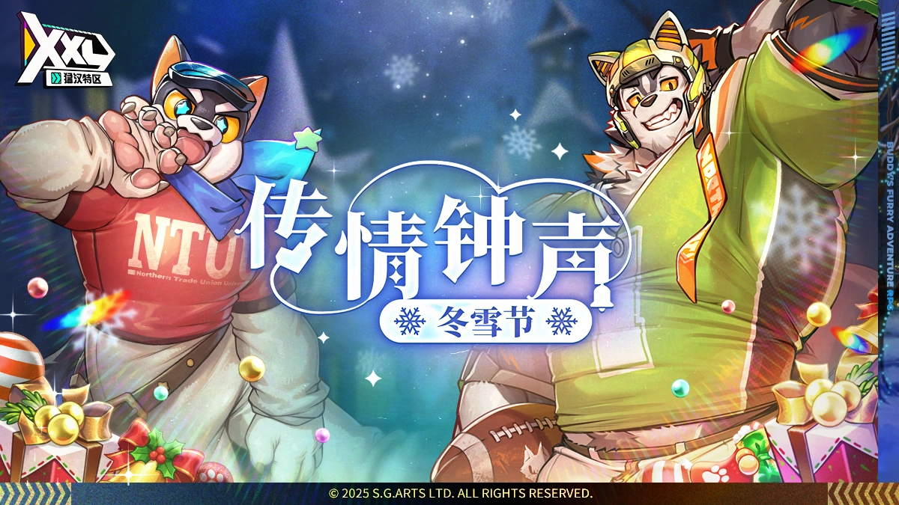
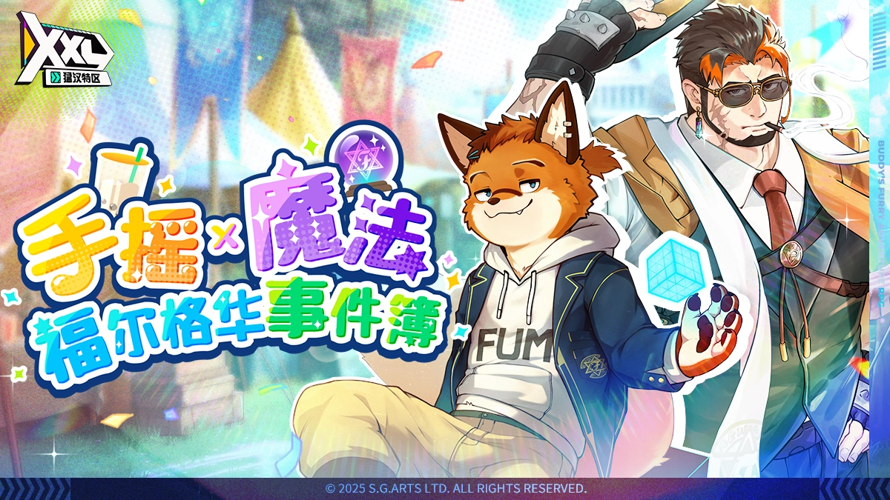

###### Coming Soon

---

###### VII 2025/12/17 Chime of Love: Winter Snow

---
[Event] Chime of Love: Winter Snow Begins!

---

---
Snow blankets the entire Northern Trade Union University campus in a soft white glow. Streetlights
and rooftops are dusted with frost. It's that time of year again—the Winter Snow, the event students
look forward to the most.

This year's highlight is the gifting event led by the school mascot Star Pup. On this day of sharing
heartfelt messages, fans of the star quarterback Famido have been gearing up, ready to confess to
their beloved idol.

As for the two campus icons at the center of everyone’s attention... Could they also be harboring
feelings they wish to convey to someone special? A lively yet heartwarming campus story is about to
unfold this winter.

Event Period:

Part I: 2025/12/17 after maintenance – 2026/01/14 14:59 (UTC+8)

Part II: 2025/12/30 after maintenance – 2026/01/14 14:59 (UTC+8)

Clear the event stages for Winter Snow Present and use it in the brand-new Lucky Poke mini game! The
Winter Snow Sock obtained can then be exchanged for background, title, avatar border, and more!

---
> https://news.playhorny.com/en-US/xxlwoofia/4/post/1485
---

###### VI 2025/11/19 Boba & Magic: The Furvale Files

---
[Event] Boba & Magic: The Furvale Files Begins!

---

---
The Furvale Appreciation Fair is in full swing—come and soak up the warmth and festive spirit
together! Browse the booths with magical goods, indulge in delicious and creative snacks, and
collect event stamps to earn rewards! In this season of gratitude, let's share laughter and
blessings, and turn our heartfelt wishes into the best memories.

This year, student council president Kantos is using his professional expertise and research to open
a special booth featuring "creative wellness potion drinks" together with vice president Fogue and
treasurer Rutenix.

The ever-worried student council president, in an effort to solve the council's long-standing budget
shortage, reluctantly accepts the treasurer's proposal and decides to take on a rather unusual
mission. What kind of encounters and challenges await him next? For now, grab yourself a full-sugar
bubble tea and enjoy the show!

Event Period:

Part I: 2025/11/19 after maintenance – 2025/12/17 14:59 (UTC+8)

Part II: 2025/12/03 after maintenance – 2025/12/17 14:59 (UTC+8)

Clear the event stages for VIP Token and Shopping Credit, which can then be exchanged for rewards at
Event Market! New rewards such as background, title, avatar border, and Buddy outfit will also be
made available gradually!

---
> https://news.playhorny.com/en-US/xxlwoofia/4/post/1419
---

###### V 2025/10/22 Rivalry x Heat

---
[Event] Rivalry x Heat Begins!

---

---
The annual Hunk Parade is coming! People from all across WOOFIA are gathering along the rainbow
track, filling the streets with cheers and rainbow flags. The grand opening of the parade is about
to begin!

Leading the charge are two of the most famous star racers—Golden Ryder and Jet Black. They'll go
head-to-head down the rainbow track, racing with blazing speed and unstoppable energy, igniting the
parade's opening like never before!

"Ahahaha! Come on, come on~ Run faster, Rodd!"

"This time, victory's mine, Delkon!"

Section Hunk is always lively and full of energy—but on this day, the excitement will reach a whole
new peak. Can these two deliver the perfect opening for the Hunk Parade? Catch the live stream and
find out!

Event Period

Part I: 2025/10/22 after maintenance - 2025/11/19 14:59 (UTC+8)

Part II: 2025/11/05 after maintenance - 2025/11/19 14:59 (UTC+8)

Clear event stages for Nutrient Ball and Race Flag, which can then be exchanged for a brand-new
background, title, avatar frame, and a special Memory at Event Market!

---
> https://news.playhorny.com/en-US/xxlwoofia/4/post/1379
---

###### IV 2025/9/24 Wish Upon the Moon

---
[Event] Wish Upon the Moon Begins!

---

---
Golden leaves dance in the wind, painting a breathtaking scene unique to the season. Tonight,
moonlight spills quietly across the land of WOOFIA. During the Autumn Moon, a symbol of reunion,
Shin Rirang sets off toward home, wishing only to catch a glimpse of his childhood friends. However,
he is swept into the madness within the moonlight...

"Hehe, life's too short not to be yourself, follow your heart, and simply indulge, you know?"

"Even if it costs me my life, I'll stop you—!"

What schemes await Shin Rirang? Will he be able to see his childhood friends?

Event Period

Part I: 2025/09/24 after maintenance - 2025/10/22 14:59 (UTC+8)

Part II: 2025/10/08 after maintenance - 2025/10/22 14:59 (UTC+8)

Clear event stages for Lunar Delight and Honey Pomelo, which can then be exchanged for a brand-new
background, title, avatar frame, and a special Memory at Event Market!

---
> https://news.playhorny.com/en-US/xxlwoofia/4/post/1334
---

###### III 2025/8/27 Bearman's Labyrinth

---
[Event] Bearman's Labyrinth Begins!

---

---
The annual WOOFIA doujin convention is underway at Section Hunk!

On a special request, Ying Hugeeu heads to the convention to search for the long-missing black bear
Beastfolk artist, Wang. Following the trail, Ying Hugeeu arrives at the closed venue after
nightfall—only to encounter a mysterious three-headed Beastfolk, Anuberus.

With eerie sounds echoing through the air while fleeting, unfamiliar figures shimmer in the shadows,
the venue is enveloped in an uncanny sense of unease...

Will Ying Hugeeu find Wang? And what epic challenges lie ahead?

Event Period:

08/27 after maintenance ~ 09/24 14:59 (UTC+8)

The event is split into 2 parts, with new content unlocking over time—stay tuned!

After maintenance on August 27, all rewards for this event will be available to exchange.

Clear event stages for Mixed Paint and Old Fanzine, which can then be exchanged for a brand-new
background, title, and avatar frame and other great rewards at Event Market!

---
> https://news.playhorny.com/en-US/xxlwoofia/4/post/1273
---

###### II 2025/7/30 Lion, Dragon & Antique Store

---
[Event] Lion, Dragon & Antique Store Begins!

---

---
"It exists everywhere and yet nowhere at all—"

"Tied to the past, reaching into the future... and flickering in the fleeting moment we call now."

In a realm where mystery and the uncanny converge, at the crossroads of time and space, all the
wonders of WOOFIA come together.

And when "the door" slips open—

A sense of mystery seems to unfold...

The second son of House Narcis, Léo, ends up as a dragon Beastfolk's servant?!

Cornered by a towering dragon debt collector, Léo is forced to strike a deal: he'll repay the
family's debt himself. But under Tyrantino's supervision, will he actually manage to settle the
score?

Event Period:

07/30 after maintenance ~ 08/27 14:59 (UTC+8)

The event is split into 2 parts, with new content unlocking over time—stay tuned!

During the event period, clear event stages for Sample Merch and Mysterious Leaf, which can then be
exchanged for a brand-new background, title, and avatar frame at Event Market. An exclusive new
Buddy is also waiting for you!

---
> https://news.playhorny.com/en-US/xxlwoofia/4/post/1224
---

###### I 2025/7/3 Pirates & Island Escape

---
[Event] Pirates & Island Escape Begins!

---

---
A legendary relic—the Twin-Headed Dragon Staff—lay hidden within the forbidden island temple, said
to hold mysterious power. Shark pirate Capt. Locke, with his sights set on the relic, was determined
to explore the forbidden seas!

However, fate had other plans—a Patrol Officer boarded his ship... And it turned out to be his old
classmate from the Naval Academy.

A grand showdown on the high seas was about to begin—who would emerge victorious?

Event Period:

07/03 05:00 ~ 07/31 04:50 (UTC+8)

The event is split into two parts, with new content unlocking over time—stay tuned!

During the event period, clear event stages for Torn Map and Coconut Water, which can then be
exchanged for rewards at Event Market. A new Background, Title, Avatar Frame, and a mysterious
memory will also unlock over time!

---
> https://news.playhorny.com/en-US/xxlwoofia/4/post/1187
---