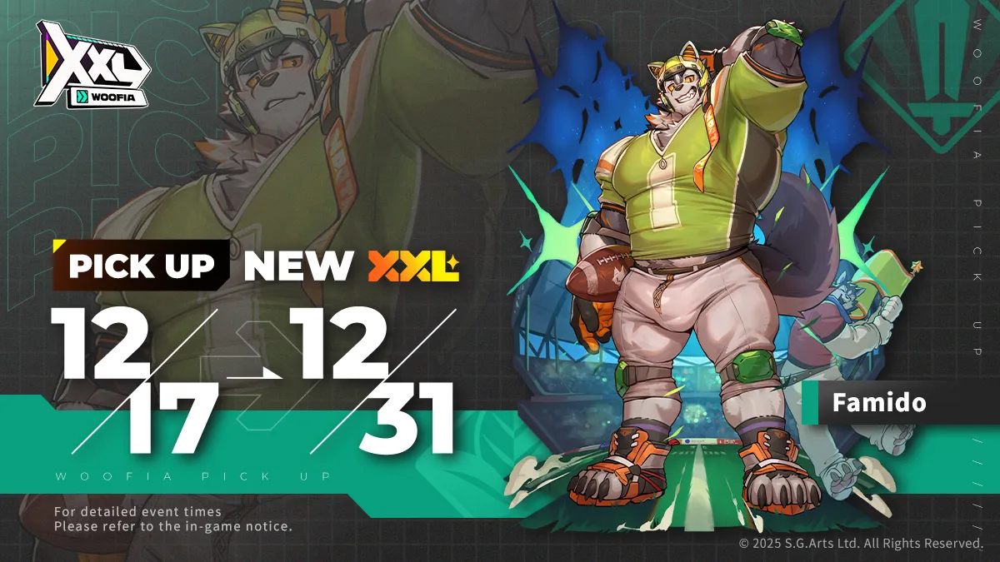
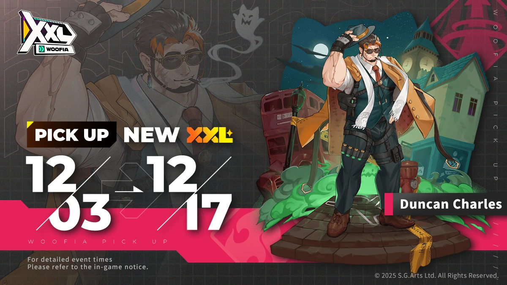
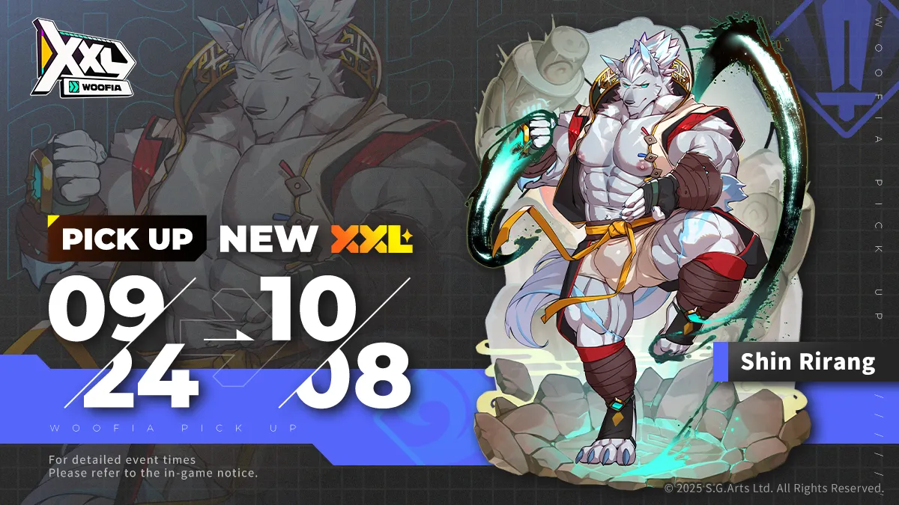
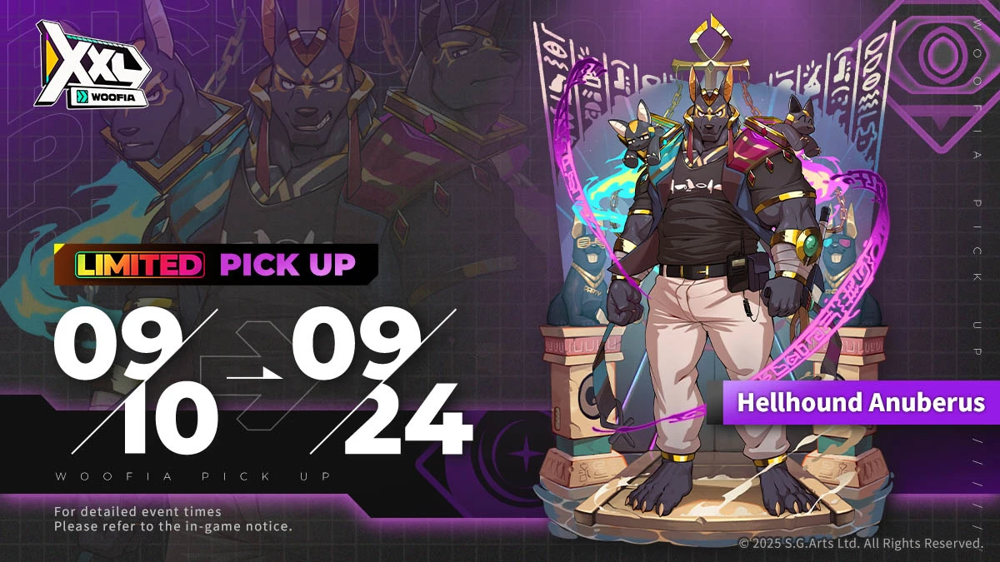
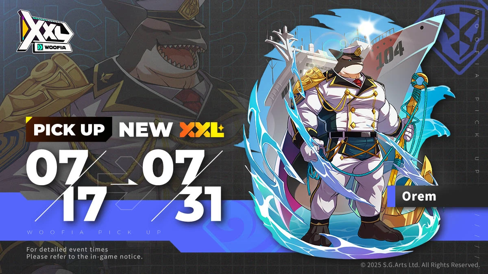
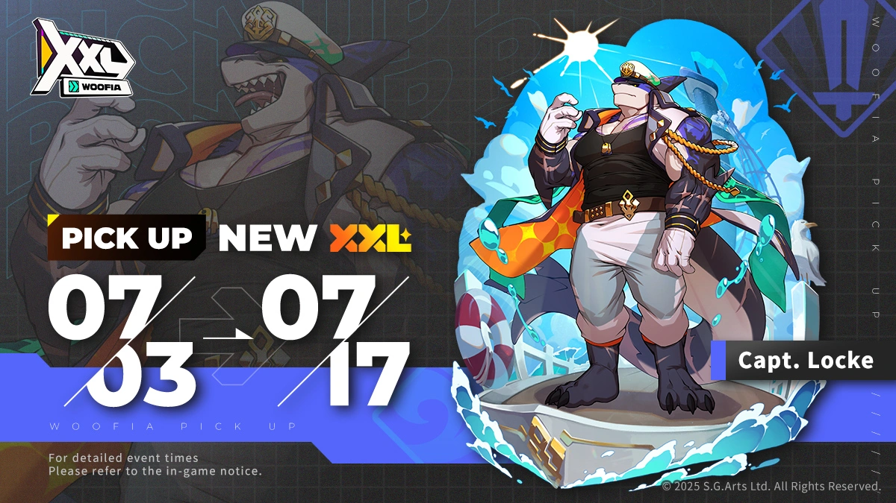

###### Coming Soon

---

###### XVI

---

###### 2025/12/30 VII Hellhound Anuberus

---
XXL Buddy: Hellhound Anuberus Pick-Up Summon Begins!

---

---
The Hellhound Descends again—

2025/12/30 after maintenance - 2026/01/14 14:59 (UTC+8)

LIMITED Pick Up SPECIAL Summon—XXL Buddy Hellhound Anuberus is here!

●Hellhound Anuberus

Type: Dark

Role: Vandal

Traits: Multi-Built-in Damage Buff

---
Though Blackey, Whitey and Yelloy all have different personalities, they are unstoppable when they
fight together.

May the powerful cerberus wins your fights! Nee hee hee~

---
> https://news.playhorny.com/zh-CN/xxlwoofia/4/post/1503
---

###### XV 2025/12/30 Ricano

---
XXL Buddy Ricano Pick-Up Summon Now Available!

---

---
2025/12/30 after maintenance - 2026/01/14 14:59 (UTC+8)

The droprate for XXL Buddy Ricano will be greatly increased!

"Arf! Do you also want a photo with Star Pup?"

Type: Fire

Role: Vandal

Traits: Weakening EX / Taunting Mark

---

Ricano is a Husky Beastfolk who, like Famido, comes from the Northern Ruins. He is also a member of
the student council at NTUU. He serves as the performer for the campus mascot, Star Pup. His
physical abilities are astounding, even in the heavy mascot costume, he can effortlessly perform
difficult maneuvers like tumbles and jumps, making him very popular among students and faculty.
Whether it's for club activities, intercollegiate competitions, or other large-scale events,
Ricano/Star Pup can always be seen, full of energy, and always manages to hype up the crowd in no
time.

Thanks to Ricano's ingenuity, the Star Pup costume is even equipped with a voice changer, overcoming
the limitation of silent mascots and making his portrayal of Star Pup even more lively.

---
> https://news.playhorny.com/en-US/xxlwoofia/4/post/1501
---

###### XIV 2025/12/17 Famido

---
XXL Buddy Famido Pick-Up Summon Now Available!

---

---
2025/12/17 after maintenance - 2025/12/31 14:59 (UTC+8)

The droprate for XXL Buddy Famido will be greatly increased!

Hey! Come play on my team?

Type: Wood

Role: Fighter

Traits: Centerline Assault / Tactical Charge

---
Famido, captain of the NTUU Football Team and the very soul of the lineup, serves as both their
leader and star quarterback.

He has carried the team through countless hard-fought games, winning victory after victory. With his
exceptional leadership, natural charisma, and a look that blends cuteness with undeniable charm, he
has captured the hearts of fans both on and off the field. Some supporters have even formed a
dedicated fan club for him, and at every match, a cheering squad waves banners high, shouting his
name with all their might.

---
> https://news.playhorny.com/en-US/xxlwoofia/4/post/1474
---

###### XIII 2025/12/3 Duncan Charles

---
XXL Buddy Duncan Charles Pick-Up Summon Now Available!

---

---
2025/12/03 after maintenance - 2025/12/17 14:59 (UTC+8)

The droprate for XXL Buddy Duncan Charles will be greatly increased!

"Duncan Charles. Don't fret, I'm not here on an investigation."

Type: Fire

Role: Support

Traits: Sniper Triple Strike / Power Boost

---
During his school years, Duncan Charles was deeply influenced by the senior detectives around him.
Growing up surrounded by their work, he developed a strong admiration for the profession. Driven by
a strong sense of justice, he trained in magic with the goal of joining the Magical Regulation
Bureau. However, his efforts never translated into results. His magical ability remained near the
bottom of his class. In order to pass the licensing exam, he made a bold choice. He began studying
firearms, tools often looked down upon by traditional wizards, and devoted himself to the
underexplored field of generative magic, attempting to combine the two. This unconventional pursuit
unexpectedly opened a new path for him. Duncan set a new record by becoming the first student
admitted with the lowest score. His acceptance made him both controversial and highly talked-about
among his peers.

---
> https://news.playhorny.com/en-US/xxlwoofia/4/post/1429
---

###### XII 2025/11/19 Rutenix

---
XXL Buddy Rutenix Pick-Up Summon Now Available!

---

---
2025/11/19 after maintenance - 2025/12/03 14:59 (UTC+8)

The droprate for XXL Buddy Rutenix will be greatly increased!

Hehe... I just came up with a money-making idea! Want in?

Type: Wood

Role: Vandal

Traits: Clever Heist / Dual Tactics

---
Rutenix is the current student council treasurer at Furvale, who always wears a smirk on his face.
His mind is constantly racing with ways to raise more funds for the council, coming up with
clever—and sometimes mischievous—ideas. Anything on campus could potentially be turned into a new,
highly profitable venture by him.

Because he is far stricter than Kantos when it comes to approving student budget applications, some
jokingly call him the Walking Student Council Cashflow System.

---
> https://news.playhorny.com/en-US/xxlwoofia/4/post/1414
---

###### XI 2025/11/5 Jet Black

---
XXL Buddy Jet Black Pick-Up Summon Now Available!

---

---
2025/11/05 after maintenance - 2025/11/19 14:59 (UTC+8)

The droprate for XXL Buddy Jet Black will be greatly increased!

"Call me 'Rodd' in private. It's totally fine by me!"

Type: Water

Role: Support

Traits: Power Build-Up / Burst Attack

---
Equinians were once frequently employed as messengers, running errands and delivering letters
between villages. Later, with the progress of the times, they established their own tribal
businesses in the Northern Lands and became increasingly active. You can often see them in the daily
lives of the general public. Aside from entertainment activities like the Equinians' race,
rickshaws, and food delivery, Black Horse Express, a well-known delivery service, is also a branch
of the vast business empire of the Equinians.

---
> https://news.playhorny.com/en-US/xxlwoofia/4/post/1401
---

###### X 2025/10/22 Golden Ryder

---
XXL Buddy Golden Ryder Pick-Up Summon Now Available!

---

---
2025/10/22 after maintenance - 2025/11/05 14:59 (UTC+8)

The droprate for XXL Buddy Golden Ryder will be greatly increased!

"You looking to ride a rickshaw, or ride m— Just kidding~ Haha!"

Type: Fire

Role: Fighter

Traits: Basic Attack Boost / Follow-up Hit

---
Golden Ryder, the Equinian, is actually called Delkon. His nickname, Golden Ryder, is usually used
during races, while his actual name is less known. He grew up alongside Rodd, and their relationship
is... well, it's hard to say for sure. They get along, but every time they talk, they end up
quarreling.

---
> https://news.playhorny.com/en-US/xxlwoofia/4/post/1377
---

###### IX 2025/10/8 Covetous Wolf

---
XXL Buddy Covetous Wolf Pick-Up Summon Now Available!

---

---
2025/10/08 after maintenance - 2025/10/22 14:59 (UTC+8)

The droprate for XXL Buddy Covetous Wolf will be greatly increased!

"You're eager to have some fun with me as well, right~♡"

Type: Fire

Role: Vandal

Traits: AoE Sleep / Burst Damage

---
Covetous Wolf comes from the Outer Realm, and is the star lord of one of the many celestial bodies.
Due to his noble status, most people who know his true identity refer to him as "Star Lord Covetous
Wolf." However, the name sounds rather aggressive, and it seems he is not particularly fond of it.

---
> https://news.playhorny.com/en-US/xxlwoofia/4/post/1362
---

###### VIII 2025/9/24 Shin Rirang

---
XXL Buddy Shin Rirang Pick-Up Summon Now Available!

---

---
2025/09/24 after maintenance - 2025/10/08 14:59 (UTC+8)

The droprate for XXL Buddy Shin Rirang will be greatly increased!

"Please allow me to demonstrate

the fruits of my years of training."

Type: Water

Role: Fighter

Traits: Multi-Buff / Single-Target Burst

---
Shin Rirang is a wolf Beastfolk from the rural area of Dongyeo City, where he grew up alongside Choi
Yuhyun and Byun Woogyu. The 3 of them are childhood friends that share a tight bond like that
between family members.

Shin Rirang has a calm and sincere personality, like a warm flame burning quietly. His heart-felt
words always manage to warm those around him unknowingly. He also has a strong sense of justice that
rivals that of Choi Yuhyun. However, despite appearing perfect, he has a bad habit of doing
everything with his feet instead of his hands. He is so good with his feet that he has trouble
switching back to using his hands.

---
> https://news.playhorny.com/en-US/xxlwoofia/4/post/1332
---

###### VII 2025/9/10 Hellhound Anuberus

---
XXL Buddy Hellhound Anuberus LIMITED Pick-Up Summon Now Available!

---

---
2025/09/10 15:00 - 2025/09/24 14:59 (UTC+8)

The droprate for XXL Buddy Hellhound Anuberus will be greatly increased!

"Yay hey hey~" "Nee hee hee~"

"Both of you, quiet down!!!"

Type: Dark

Role: Vandal

Traits: Multi-Built-in Damage Buff

---
Anuberus is a new-generation, being born from the integration of Netherworld affairs of various
regions—a hybrid of Cerberus and Anubis.

He belongs to the Discipline Division of the Department of Management of the Dead, and his regular
duties include guarding the entrance to the "Club Zone" that leads to the Netherworld. However,
since the Netherworld is always dim and dark, this essentially means he works nearly 24 hours a day,
and it sounds like an incredibly exhausting and daunting job.

※The LIMITED Dark XXL Buddy: Hellhound Anuberus will NOT be added to the Regular Summon in the
future.

---
> https://news.playhorny.com/en-US/xxlwoofia/4/post/1289
---

###### 2025/9/9 II&III Capt. Lock & Orem

---
XXL Buddy Capt. Lock & Orem Meet-Up Special Summon Now Available!

---

---
Meet up with Capt. Lock and Orem at Section Hunk!

XXL Buddies Capt. Locke & Orem Meet-Up Special Summon

Event Period: 09/09 17:10 ~ 09/24 14:59 (UTC+8)

●Capt. Locke

Type: Water

Role: Fighter

Trait: Low HP Follow-Up Damage

●Orem

Type: Water

Orem: Tank

Trait: Iron Barrier / Offensive Guard

---
Perform a certain number of summons to choose 1 XXL Buddy from Capt. Locke and Orem! As a powerful
Fighter and a Tank, they'll be your key in clearing stages!

---
> https://news.playhorny.com/en-US/xxlwoofia/4/post/1302
---

###### VI 2025/8/27 Wang

---
XXL Buddy Wang Pick-Up Summon Now Available!

---

---
2025/08/27 after maintenance - 2025/09/10 14:59 (UTC+8)

The droprate for XXL Buddy Wang will be greatly increased!

"If it's you... maybe you'll reignite my passion for art creation."

Type: Wood

Role: Support

Traits: AoE Follow-up Hit / Multi-Damages

---
Wang is a black bear Beastfolk artist who creates arts inspired by primal desires and expresses his
ideas through various media—a so-called Feralist artist.

His works aren't mainstream or highly exposed on social media platforms, but he has a dedicated fan
base.

However, at some point, Wang suddenly vanished from all the platforms he used to be active on, which
sparked some discussions among his acquaintances.

---
> https://news.playhorny.com/en-US/xxlwoofia/4/post/1272
---

###### V 2025/8/13 Tyrantino

---
XXL Buddy Tyrantino Pick-Up Summon Now Available!

---

---
2025/08/13 after maintenance - 2025/08/27 14:59 (UTC+8)

The droprate for XXL Buddy Tyrantino will be greatly increased!

"Ready? Then... it's time for an all-or-nothing game."

Type: Water

Role: Vandal

Traits: AoE ATK Debuff / Stacked EX

---
Beneath WOOFIA lies a vast, upscale residential area controlled by the dragon Beastfolks, known as
the Draconic Depths. Those that dwell there have a long and illustrious heritage, enjoying a
high-end lifestyle. Their main pastime is collecting rare treasures from all over WOOFIA. Due to
their noble status, interacting with them often leaves people under immense pressure, as if they
were always being looked down upon.

And Tyrantino is a prime example of this typical dragon Beastfolk personality.

---
> https://news.playhorny.com/en-US/xxlwoofia/4/post/1256
---

###### IV 2025/7/30 Léo von Narcis

---
XXL Buddy Léo von Narcis Pick-Up Summon Now Available!

---

---
2025/07/30 after maintenance - 2025/08/13 14:59 (UTC+8)

The droprate for XXL Buddy Léo von Narcis will be greatly increased!

"It's a great honor for you to befriend me~"

Type: Fire

Role: Healer

Traits: HoT / Damage Reduction

---
As a member of a prestigious house on Rodney Volcanoes, Léo von Narcis from the Narcis family
believes that he was born suprerior, enjoying praise and support from those around him. Although he
doesn't reallt know what the others think, at least he himself believes so.

---
> https://news.playhorny.com/en-US/xxlwoofia/4/post/1223
---

###### III 2025/7/17 Orem

---
XXL Buddy Orem Pick-Up Summon Now Available!

---

---
2025/07/17 05:00 - 2025/07/31 04:50 (UTC+8)

The droprate for XXL Buddy Orem will be greatly increased!

"Oceanic Patrol Officer, Orem.

I'll follow your command."

Type: Water

Role: Tank

Traits: Iron Barrier / Offensive Guard

---
In private, Orem actually has a playful and open side, much more easygoing than he appears to be
while on duty. He enjoys games that most people don't find interesting, such as ring toss, goldfish
scooping, bumper cars at night markets, and so on. He also seems to like outdoor sports like
basketball, giving off a surprisingly energetic vibe.

However, because he's very strict about keeping work and personal life separate, whenever he returns
to the navy after taking some time off, it always takes him a bit of time to adjust his playful
mindset back to professional mode.

---
> https://news.playhorny.com/en-US/xxlwoofia/4/post/1204
---

###### II 2025/7/3 Capt. Locke

---
XXL Buddy Capt. Locke Pick-Up Summon Now Available!

---

---
2025/07/03 05:00 - 2025/07/17 04:50 (UTC+8): The droprate for XXL Buddy Capt. Locke will be greatly
increased!

"Kahaha! Set sail, lads—!

The Proud Shark, full speed—!"

Type: Water

Role: Fighter

Traits: Low HP Follow-Up Damage

---
Capt. Locke's personality is just as wild as he appears. He is not the type of disciplined captain
that only follows the rules. To be blunt, he can even be described as a bit chaotic. It's not
uncommon to see him causing a ruckus on social media with some bizarre incident he caused in the
Draconic Depths.

Although he may not realize it himself, his unruly and carefree personality seems to make him quite
popular among his crew, quite a unique charm exclusive to Captain Locke.

---
> https://news.playhorny.com/zh-CN/xxlwoofia/4/post/1186
---

###### I 2025/6/19 Baade

---
XXL Buddy Baade Pick-Up Summon Now Available!

---

---
2025/06/19 - 2025/07/03 04:59 (UTC+8)

The droprate for XXL Buddy Baade will be greatly increased!

"For my family, I'd go down the deepest mine."

Type: Fire

Role: Fighter

Traits: Focused Assault / Persistent Damage

---
In the Northern Lands, Baade is a foreman working under Damian's mining business, mainly responsible
for gathering minerals.

He is a black hare Beastfolk, who originally had a bold and sometimes even rough personality. After
becoming a father, he seemed to soften and become more sensitive. Perhaps this is a testament to how
devoted he has been to his kids.

---
> https://news.playhorny.com/en-US/xxlwoofia/4/post/1140
---